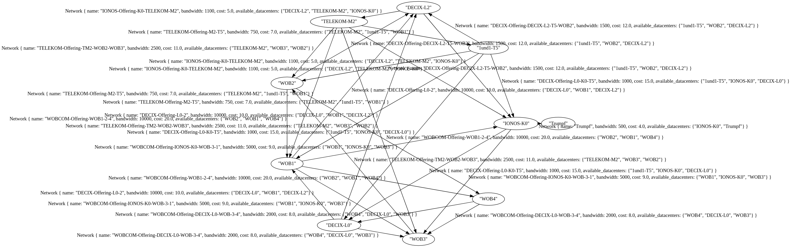

# Tellus Network Graph Demo
This small rust program discovers graph-datastructures
as the data-backbone of the tellus registry and network-/cloud-matching.

## What does it do?
It builds a graph out of network offerings defined in the [csv](./test_networks.csv)
and returnes the needed offerings for the shortest path based on ``bandwidth`` and ``cost``.

You also get a graphviz diagram of the network graph in order to visualize the offerings:


## Handling
In order to build the project run:
```bash
  docker build -t graph-demo . -f ./Containerfile
```
Running the project:
```bash
  docker run -it --rm graph-demo
  # with custom query
  docker run -it --rm graph-demo /demo/graph WOB1 Trumpf cost
```
### Parameter Table
| 0 | 1 | 2 | 3 |
| --- | --- | --- | --- |
| Programm | Start Datacenter | End Datacenter | Priority |
| `/demo/graph` | `WOB1` | `Trumpf` | `cost`, `bandwidth` |

### Sample Output
```txt
Query: 	(WOB1 to Trumpf prio cost)
BW: 	7.5 Gbit/s,
Hops: 	6
Costs: 	59€,
Path: 	
	DECIX-Offering-L0-2
	TELEKOM-Offering-M2-T5
	IONOS-Offering-K0-TELEKOM-M2
	DECIX-Offering-L0-K0-T5
	DECIX-Offering-DECIX-L2-T5-WOB2
```
